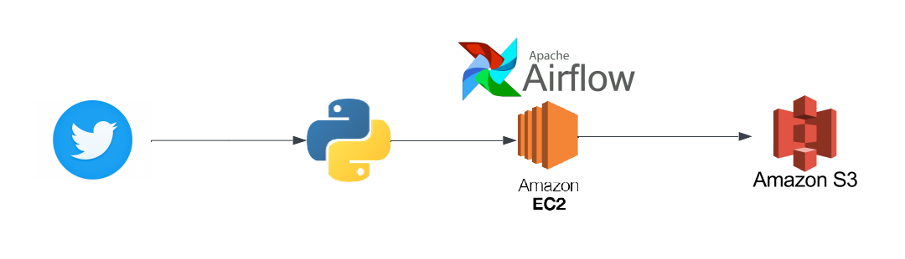

# twitter-airflow-data-engineering-project
This repo consists of all the code that pulls data from twitter, schedules script on airflow via EC2 and pushes data to s3 bucket. The code written, specifically pulls `nasa` tweets, creates a dataframe and finally pushes the csv to s3 bucket via airflow scheduling.
My goal for this project was to learn and try airflow, understand how dags work, utilize AWS services.

### Steps Involved

* Create a twitter developer account
* Extract the api keys or bearer token based on which twitter api are you using
* Write a python script to extract required data from tweepy api
* Write a python dag script to run the file on airflow 
* Create AWS EC2 intance 
* Connect to AWS EC2 instance via SSH from local terminal 
* Install required python and twitter packages on the instance
* Install apache airflow 
* Run Apache airflow on port 8080
* Create s3 bucket to push the final file that was created
* Move all local files on EC2 instance using `scp` command 
* Run the dag that was created on airflow and fix if there are any errors. 
* Final result: You should be able to see the file with all the required data on s3 bucket

### Architecture Diagram 

## Services Used

The following services are integral to our project and collectively support our data processing, storage, analysis, and reporting needs in an efficient and scalable manner:

1. **Apache Airflow**  
   Apache Airflow is an open-source platform designed to programmatically author, schedule, and monitor workflows. It is particularly well-suited for orchestrating complex data workflows, automating tasks, and managing dependencies between different tasks or processes.

2. **Twitter API**  
   The Twitter API is a developer interface for accessing and interacting with Twitter's data and services. It enables tasks like posting tweets, following users, and retrieving tweets programmatically. Developers use it to build Twitter-related applications and perform data analysis.

3. **Amazon EC2**  
   Amazon Elastic Compute Cloud (Amazon EC2) is a web service offered by Amazon Web Services (AWS) that provides resizable compute capacity in the cloud. It allows users to launch and manage virtual servers, known as EC2 instances, to run applications and workloads.

4. **Amazon S3 (Simple Storage Service)**  
   Amazon S3 is an object storage service known for its manufacturing scalability, data availability, security, and performance. It is used for storing and retrieving any amount of data at any time, from anywhere on the web.

### Challenges
Similar to others, I encountered several challenges throughout the project. Below, I've outlined these challenges to provide foresight and preparation for future endeavors.

* <u>Twitter API</u> - Twitter's API has undergone changes and is no longer entirely free. To access its full range of features, upgrading your developer account may be necessary. With this upgrade, OAuth authentication has also evolved, potentially requiring OAuth 2.0 authorization based on your specific use case.

* <u>EC2 Instance Free Tier</u> - I attempted to utilize the free tier to host Apache Airflow on an Amazon EC2 instance. However, I encountered difficulties launching Airflow on the free tier due to limited resources. Upon investigation, I discovered that deploying Airflow on an EC2 instance, especially within the confines of the free tier, can be challenging due to resource constraints. Consequently, I opted to upgrade to a paid instance type, which facilitated a smooth deployment process.

* <u>Security Block Accessing Airflow</u> - By default, Airflow operates over HTTP rather than HTTPS. Consequently, depending on your network configuration, access to the Airflow URL may be restricted for security reasons. I encountered such restrictions, prompting me to explore options for enabling HTTPS with Airflow, such as obtaining an SSL certificate from AWS Certificate Manager. However, since my project was a one-time endeavor, I opted to resolve the issue by connecting to a different network, thereby circumventing the security block and gaining access to the Airflow URL.
